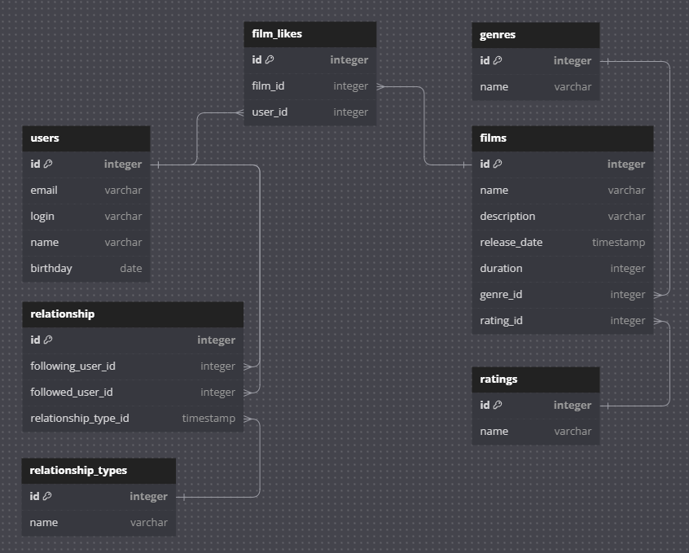

# java-filmorate
Template repository for Filmorate project.



[db.txt](db_diagram/db.txt)

### Операции с фильмами:
1. Получить список всех фильмов:
```sql
SELECT * FROM films;
```
2. Получение фильма по ID:
```sql
SELECT * FROM films WHERE id = ?;
```
3. Добавление нового фильма:
```sql
INSERT INTO films (name, description, release_date, duration, mpa_rating_id) 
VALUES (?, ?, ?, ?, ?);
```
4. Обновление данных фильма:
```sql
UPDATE films SET name = ?, description = ?, release_date = ?, duration = ?, mpa_rating_id = ? 
WHERE id = ?;
```
5. Получение всех жанров фильма по его ID:
```sql
SELECT gr.id, gr.name 
FROM genres gr 
JOIN film_genres fg ON gr.id = fg.genre_id 
WHERE fg.film_id = ?;
```
6. Получение самых популярных фильмов:
```sql
SELECT f.id, f.name, f.description, f.release_date, f.duration, f.mpa_rating_id 
FROM films f 
LEFT JOIN (
    SELECT film_id, COUNT(*) AS count 
    FROM film_likes 
    GROUP BY film_id
) t ON f.id = t.film_id 
ORDER BY t.count DESC 
LIMIT ?;
```
7. Добавление лайка пользователем к фильму:
```sql
INSERT INTO film_likes (film_id, user_id) 
VALUES (?, ?);
```
8. Удаление лайка пользователем с фильма:
```sql
DELETE FROM film_likes 
WHERE film_id = ? AND user_id = ?;
```
9. Получение количества лайков у фильма:
```sql
SELECT COUNT(*) 
FROM film_likes 
WHERE film_id = ?;
```

### Операции с пользователями:
1. Получение списка всех пользователей:
```sql
SELECT * FROM users;
```
2. Получение пользователя по ID:
```sql
SELECT * FROM users WHERE id = ?;
```
3. Добавление нового пользователя:
```sql
INSERT INTO users (email, login, username, birthday) VALUES (?, ?, ?, ?);
```
4. Обновление данных пользователя:
```sql
UPDATE users SET email = ?, login = ?, username = ?, birthday = ? WHERE id = ?;
```
5. Получение всех друзей пользователя:
```sql
SELECT u.id, u.email, u.login, u.username, u.birthday 
FROM users u 
JOIN friends f ON u.id = f.friend_id 
WHERE f.user_id = ?;
```
6. Получение общих друзей двух пользователей:
```sql
SELECT u.id, u.email, u.login, u.username, u.birthday 
FROM users u 
JOIN friends f1 ON u.id = f1.friend_id AND f1.user_id = ? 
JOIN friends f2 ON u.id = f2.friend_id AND f2.user_id = ?;
```

### Операции с жанрами:
1. Получение всех жанров:
```sql
SELECT * FROM genres;
```
2. Получение жанра по ID:
```sql
SELECT * FROM genres WHERE id = ?;
```

### Операции с рейтингами:
1. Получение всех рейтингов:
```sql
SELECT * FROM ratings;
```
2. Получение рейтинга по ID:
```sql
SELECT * FROM ratings WHERE id = ?;
```