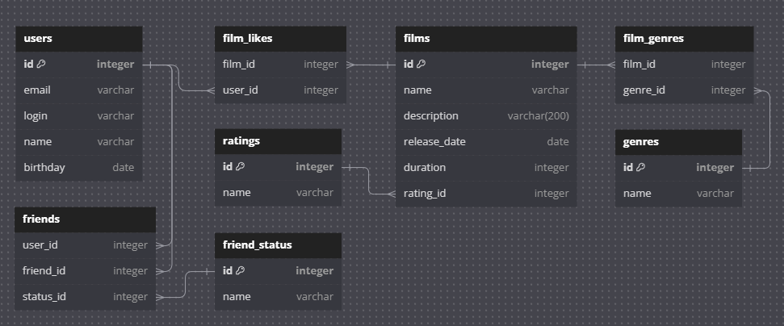

# java-filmorate
Template repository for Filmorate project.



[db.txt](db_diagram/db.txt)

# FilmController:
1. **GET /films**: Получить все фильмы.
```sql
SELECT * FROM films;
```
2. **GET /films/{filmId}**: Получить информацию о фильме по его идентификатору.
```sql
SELECT * FROM films WHERE id = {filmId};
```
3. **POST /films**: Создать новый фильм.
```sql
INSERT INTO films (name, description, release_date, duration, genre_id, rating_id)
VALUES ('Название', 'Описание', 'Дата релиза', 'Длительность', 'ID_жанра', 'ID_рейтинга');
```
4. **PUT /films**: Обновить информацию о фильме.
```sql
UPDATE films
SET name = 'Новое название', description = 'Новое описание'
WHERE id = {filmId};
```
5. **PUT /films/{id}/like/{userId}**: Поставить лайк фильму от определенного пользователя.
```sql
INSERT INTO film_likes (film_id, user_id) 
VALUES ({id}, {userId});
```
6. **DELETE /films/{id}/like/{userId}**: Удалить лайк фильма от пользователя.
```sql
DELETE FROM film_likes
WHERE film_id = {id} AND user_id = {userId};
```
7. **GET /films/popular**: Получить список популярных фильмов. 
```sql
SELECT * FROM films ORDER BY rating_id DESC LIMIT {count};
```

# UserController:
1. **GET /users**: Получить всех пользователей.
```sql
SELECT * FROM users;
```
2. **GET /users/{userId}**: Получить информацию о пользователе по его идентификатору.
```sql
SELECT * FROM users WHERE id = {userId};
```
3. **POST /users**: Создать нового пользователя.
```sql
INSERT INTO users (email, login, name, birthday) 
VALUES ('email@example.com', 'логин', 'Имя', 'Дата рождения');
```
4. **PUT /users**: Обновить информацию о пользователе.
```sql
UPDATE users
SET name = 'Новое имя'
WHERE id = {userId};
```
5. **PUT /users/{id}/friends/{friendId}**: Добавить друга для определенного пользователя.
```sql
INSERT INTO relationship (following_user_id, followed_user_id)
VALUES ({id}, {friendId});
```
6. **DELETE /users/{id}/friends/{friendId}**: Удалить друга пользователя.
```sql
DELETE FROM relationship
WHERE following_user_id = {id} AND followed_user_id = {friendId};
```
7. **GET /users/{id}/friends**: Получить список друзей определенного пользователя.
```sql
SELECT u.* 
FROM users u
JOIN relationship r ON u.id = r.followed_user_id
WHERE r.following_user_id = {id};
```
8. **GET /users/{id}/friends/common/{otherId}**: Получить список общих друзей между двумя пользователями.
```sql
SELECT u.*
FROM users u
JOIN relationship r1 ON u.id = r1.followed_user_id
JOIN relationship r2 ON u.id = r2.followed_user_id
WHERE r1.following_user_id = {id} AND r2.following_user_id = {otherId};
```